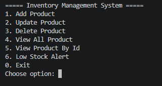
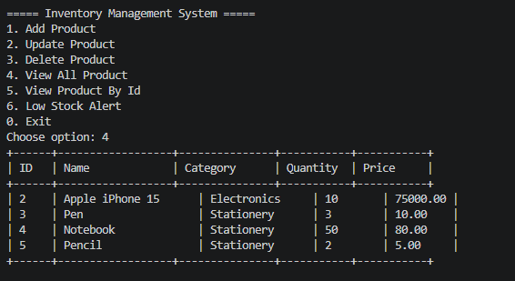
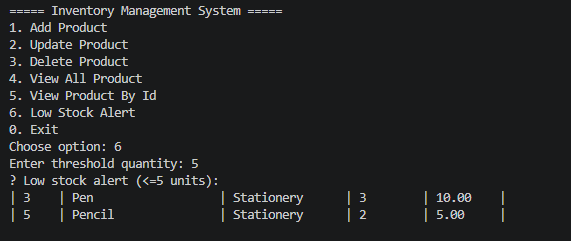

# Inventory Management System

A console-based Inventory Management System built with
Java, JDBC, and MySQL. Developed as a portfolio project
to demonstrate core backend and database skills.

---

## Features

- Add new products to inventory
- View all products in a formatted table
- Update existing product details
- Delete products by ID
- Low stock alert for products below a set threshold

---

## Tech Stack

- **Language:** Java (JDK 21)
- **Database:** MySQL
- **Connectivity:** JDBC (MySQL Connector/J)
- **IDE:** VS Code with Extension Pack for Java

---

## Project Structure

InventoryManagementSystem/
├── src/
│   └── com/ims/
│       ├── model/        → Product.java
│       ├── dao/          → ProductDAO.java, ProductDAOImpl.java
│       ├── db/           → DBConnection.java
│       ├── service/      → ProductService.java
│       └── main/         → Main.java
├── lib/
│   └── mysql-connector-j-x.x.x.jar
└── db/
└── schema.sql
---

## Database Setup

1. Open MySQL Workbench
2. Run the following:

```sql
CREATE DATABASE ims_db;
USE ims_db;

CREATE TABLE products (
    id INT AUTO_INCREMENT PRIMARY KEY,
    name VARCHAR(100) NOT NULL,
    category VARCHAR(50),
    quantity INT NOT NULL,
    price DOUBLE NOT NULL,
    created_at TIMESTAMP DEFAULT CURRENT_TIMESTAMP
);
```

---

## How To Run

1. Clone the repository:
git clone git https://github.com/AdnanHaider90/inventory-management-system.git

2. Open project in VS Code

3. Add `mysql-connector-j-x.x.x.jar` to classpath

4. Update database credentials in `DBConnection.java`:
```java
private static final String USER = "your_username";
private static final String PASSWORD = "your_password";
```

5. Run `Main.java`

---

## Screenshots

### Main Menu


### View All Products


### Show Low Stock


---

## Author

**Md Adnan Haider**  
B.Tech Computer Science | IILM University, Greater Noida  
GitHub: github.com/AdnanHaider90  
LinkedIn: linkedin.com/in/md-adnan-haider-a3065728as